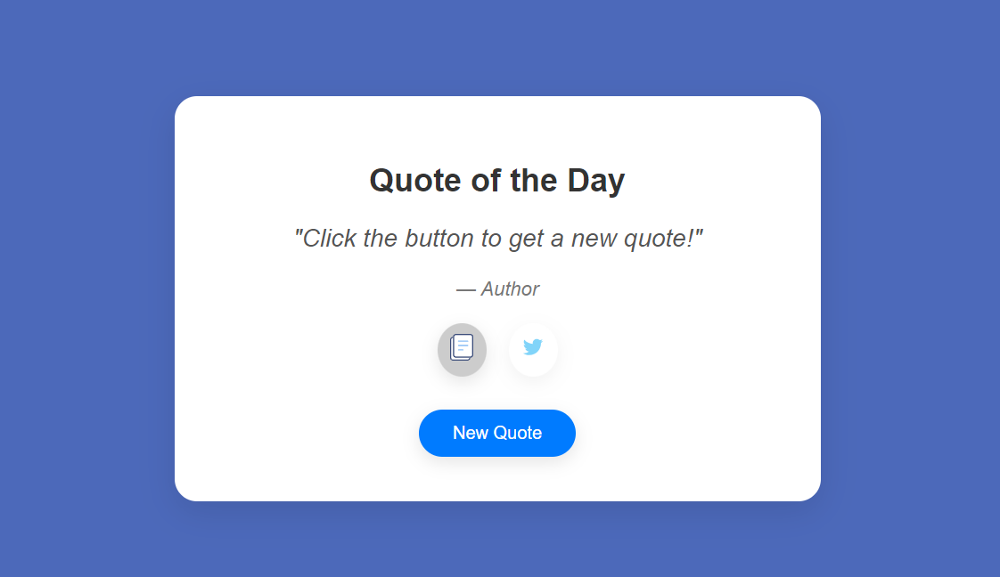
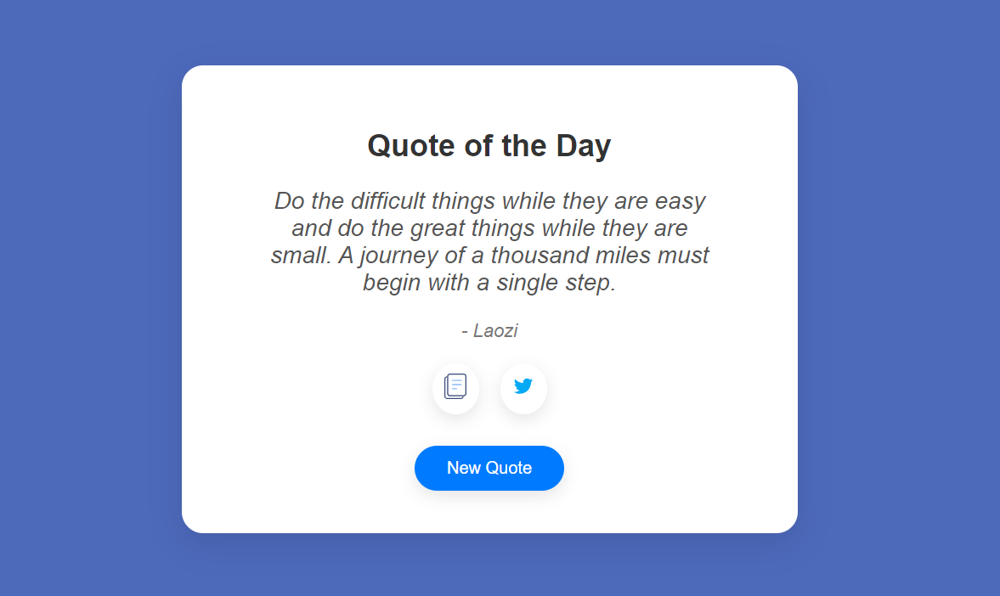

### **Quote Generator Project**

This project is a simple "Quote Generator" application built with **JavaScript**, **HTML**, and **CSS**. It allows users to generate random quotes, copy them to the clipboard, and share them on Twitter.

## Table of Contents
- [Screenshot](#screenshot)
- [Features](#features)
- [Built With](#built-with)
- [Prerequisites](#prerequisites)
- [Usage](#usage)
- [Contact](#contact)

## Screenshot




<p align="right">(<a href="#table-of-contents">back to top</a>)</p>

## Features

- Generates random quotes from a public API.
- Users can copy the quote to the clipboard.
- Allows users to share quotes directly to Twitter.
- Responsive design with a clean and minimal interface.

<p align="right">(<a href="#table-of-contents">back to top</a>)</p>

## Built With

This project was built using the following technologies:

* 
* 
* 

<p align="right">(<a href="#table-of-contents">back to top</a>)</p>

## Prerequisites

To run this project, all you need is a modern web browser that supports HTML, CSS, and JavaScript. No additional libraries or dependencies are required.

<p align="right">(<a href="#table-of-contents">back to top</a>)</p>

## Usage

1. Clone the project from GitHub or download the files:
   ```bash
   git clone https://github.com/AmirrezaAhmadi/QuoteGenerator-App.git

2. Open the QuoteGenerator App.html file in your browser.

<p align="right">(<a href="#table-of-contents">back to top</a>)</p>

## Contact

You can reach me through the following:

* Email: AmirrezaAhmadi.GH@Gmail.com
* Telegram: https://t.me/AmirrezaDevelop
* Instagram: https://www.instagram.com/codewithamirreza
* Project Link: https://github.com/AmirrezaAhmadi/QuoteGenerator-App.git

<p align="right">(<a href="#table-of-contents">back to top</a>)</p>